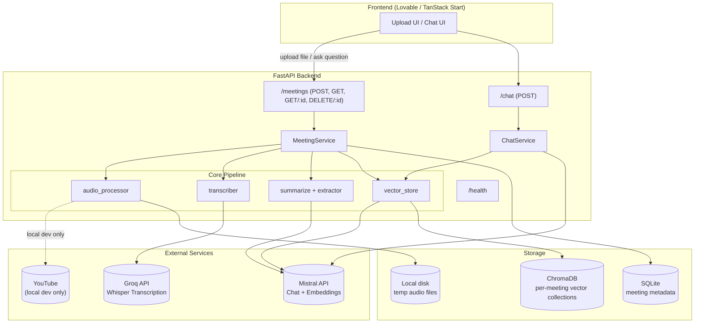
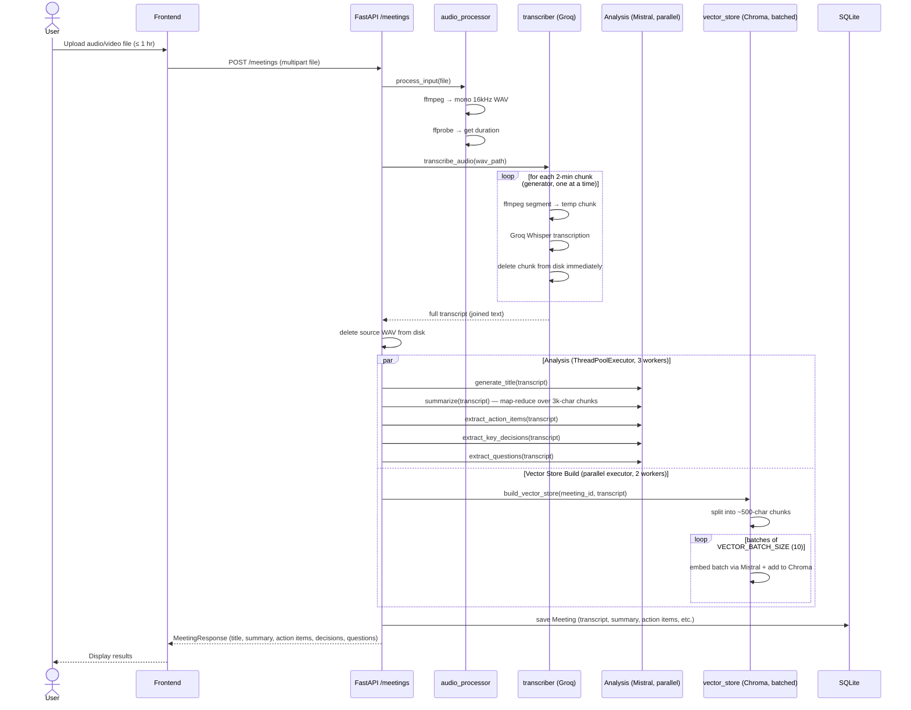

# AI Meeting Assistant — Backend

A FastAPI backend that turns a meeting recording (or, in local dev, a YouTube link) into a searchable, structured knowledge artifact: transcript, summary, action items, key decisions, open questions, and a RAG-powered Q&A chat over the meeting content.

Built for low-memory hosting (Render free tier) — audio is streamed and chunked rather than loaded wholesale, and embeddings are written in small batches to avoid OOM kills.

---

## Table of Contents

- [Overview](#overview)
- [Tech Stack](#tech-stack)
- [Architecture](#architecture)
- [Request Flow — Meeting Ingestion](#request-flow--meeting-ingestion)
- [Request Flow — Chat / Q&A](#request-flow--chat--qa)
- [Project Structure](#project-structure)
- [API Reference](#api-reference)
- [Environment Variables](#environment-variables)
- [Running Locally](#running-locally)
- [Deployment Notes (Render Free Tier)](#deployment-notes-render-free-tier)
- [Known Limitations](#known-limitations)

---

## Overview

Given a meeting recording, the backend:

1. Accepts either a **local file upload** (audio/video) or, **in local development only**, a **YouTube URL**.
2. Converts/normalizes audio to mono 16kHz WAV via `ffmpeg`.
3. Transcribes the audio in **2-minute chunks** using Groq-hosted Whisper (`whisper-large-v3-turbo`), streaming chunks one at a time instead of holding the full file in memory.
4. Runs 5 LLM analysis tasks in parallel (title, summary, action items, key decisions, open questions) via Mistral, alongside vector store construction, using thread pools.
5. Persists the meeting record to SQLite and the transcript embeddings to a per-meeting **ChromaDB** collection (batched to control memory).
6. Exposes a **RAG chat endpoint** so a user can ask natural-language questions about any past meeting, answered strictly from that meeting's transcript context.

---

## Tech Stack

| Layer            | Technology                                   |
|------------------|-----------------------------------------------|
| API framework    | FastAPI + Uvicorn                             |
| Transcription    | Groq API — `whisper-large-v3-turbo`           |
| LLM orchestration| LangChain (LCEL chains)                       |
| LLM provider     | Mistral (`mistral-small-latest`, `mistral-embed`) |
| Vector store     | ChromaDB (`langchain-chroma`), per-meeting collection |
| Relational store | SQLite via SQLAlchemy                         |
| Audio processing | `ffmpeg` / `ffprobe` (via subprocess), `yt-dlp` |
| Containerization | Docker (`python:3.11-slim` + ffmpeg)          |

---

## Architecture



---

## Request Flow — Meeting Ingestion

`POST /meetings` — this is the core pipeline and the main place OOM risk was mitigated.



**Where the OOM fixes live:**
- Audio is **chunked and transcribed one piece at a time** (generator-based `iter_chunks`), each chunk deleted right after transcription — the full file is never held in memory as one blob.
- Vector embeddings are written in **batches of `VECTOR_BATCH_SIZE` (default 10)** instead of embedding the entire transcript at once.
- The source WAV is deleted from disk immediately after transcription completes.
- `ChatService` explicitly `del`s the loaded vector store and calls `gc.collect()` after every chat request.

---

## Request Flow — Chat / Q&A

`POST /chat` — RAG over a single meeting's transcript.

```mermaid
flowchart LR
    Q[User question + meeting_id] --> LOAD["load_vector_store(meeting_id)"]
    LOAD --> RET["retriever.get_relevant_documents(question)<br/>k=4, similarity search"]
    RET --> FMT["Format retrieved chunks as context"]
    FMT --> PROMPT["Build prompt:<br/>system = meeting context<br/>human = question"]
    PROMPT --> LLM["Mistral chat completion"]
    LLM --> ANS["Answer (grounded only in transcript;<br/>falls back to 'not found' if absent)"]
    ANS --> CLEANUP["del vector_store + gc.collect()"]
    CLEANUP --> RESP[Return ChatResponse]
```



---

## Project Structure

```
backend/
├── main.py                      # FastAPI app entrypoint, CORS config, router mounting
├── requirements.txt
├── Dockerfile
├── docker-compose.yml
└── app/
    ├── config.py                 # Settings (API keys, model names, batch sizes)
    ├── api/
    │   ├── router.py              # Aggregates all route modules
    │   └── routes/
    │       ├── health.py          # GET /, GET /health
    │       ├── meetings.py        # POST/GET/DELETE /meetings
    │       └── chat.py            # POST /chat
    ├── services/
    │   ├── meeting_service.py     # Orchestrates the full ingestion pipeline
    │   ├── chat_service.py        # RAG Q&A logic
    │   └── storage_service.py     # Cleans up files on meeting delete
    ├── core/
    │   ├── llm.py                 # Centralized Mistral LLM factory
    │   ├── transcriber.py         # Groq Whisper transcription, chunk streaming
    │   ├── summarize.py           # Map-reduce summary + title generation
    │   ├── extractor.py           # Action items / decisions / open questions
    │   └── vector_store.py        # Chroma build/load/retriever, batched embedding
    ├── utils/
    │   └── audio_processor.py     # yt-dlp download (dev), ffmpeg convert/chunk/duration
    ├── db/
    │   ├── database.py            # SQLAlchemy engine/session
    │   ├── models.py               # Meeting ORM model
    │   └── dependencies.py        # get_db dependency
    ├── repositories/
    │   └── meeting_repository.py  # CRUD against SQLite
    └── schemas/                   # Pydantic request/response models
```

---

## API Reference

| Method | Endpoint          | Description                                              |
|--------|-------------------|------------------------------------------------------------|
| GET    | `/`               | Root health message                                        |
| GET    | `/health`         | Health check                                                |
| POST   | `/meetings`       | Ingest a meeting — provide **either** `file` (multipart) **or** `youtube_url` (form field, dev only) |
| GET    | `/meetings`       | List all processed meetings (summary view)                 |
| GET    | `/meetings/{id}`  | Full detail for one meeting (transcript, summary, etc.)    |
| DELETE | `/meetings/{id}`  | Delete a meeting and its associated stored assets          |
| POST   | `/chat`           | Ask a question about a specific meeting (`meeting_id`, `question`) |

---

## Environment Variables

| Variable              | Required | Default                | Notes |
|-----------------------|----------|-------------------------|-------|
| `GROQ_API_KEY`        | ✅       | —                        | Whisper transcription |
| `MISTRAL_API_KEY`     | ✅       | —                        | Chat + embeddings |
| `GROQ_WHISPER_MODEL`  | ❌       | `whisper-large-v3-turbo` | |
| `MISTRAL_MODEL`       | ❌       | `mistral-small-latest`   | |
| `EMBEDDING_MODEL`     | ❌       | `all-MiniLM-L6-v2`       | Declared but embeddings currently use `mistral-embed` |
| `UPLOAD_DIR`          | ❌       | `uploads`                | |
| `VECTOR_DB_DIR`       | ❌       | `vector_db`              | |
| `CHROMA_COLLECTION`   | ❌       | `meeting_transcripts`    | |
| `VECTOR_BATCH_SIZE`   | ❌       | `10`                     | Lower this further if still hitting memory limits |

Set these in a `.env` file at the project root (not committed).

---

## Running Locally

```bash
# 1. Create and activate a virtual environment
python -m venv venv
source venv/bin/activate   # or venv\Scripts\activate on Windows

# 2. Install dependencies
pip install -r requirements.txt

# 3. Set environment variables in .env
echo "GROQ_API_KEY=your_key_here" >> .env
echo "MISTRAL_API_KEY=your_key_here" >> .env

# 4. Run the server
uvicorn main:app --reload --host 0.0.0.0 --port 8000
```

Or with Docker:

```bash
docker compose up --build
```

In local dev, both file upload **and** YouTube URL ingestion are available. YouTube ingestion uses `yt-dlp` to download and extract audio before it enters the same chunking/transcription pipeline.

---

## Deployment Notes (Render Free Tier)

- **YouTube ingestion is not reliable in hosted environments.** YouTube actively blocks datacenter/bot IPs (which is what Render's free tier egresses from), so `yt-dlp` downloads frequently fail there even though they work fine locally. The frontend should disable/hide the YouTube URL option in production and only offer file upload.
- **Audio length should be capped at ~1 hour per upload.** Longer recordings increase peak memory during conversion, chunking, and transcript accumulation, which risks OOM kills on Render's free tier (512MB RAM). This should be enforced both in the UI and ideally with a server-side duration/file-size check in `meetings.py`.
- Memory-conscious design choices already in place: chunked/streamed transcription, immediate deletion of temp audio, batched vector embedding, and explicit garbage collection after chat requests.

---

## Known Limitations

- No authentication/authorization on any endpoint — anyone with the URL can create, view, or delete meetings.
- `youtube_url` ingestion has no server-side environment gate yet; it will still be attempted if called directly via the API in production (and will simply fail with an `HTTPException` from `download_youtube_audio`).
- No enforced max file size / duration at the API layer yet — currently relies on the frontend and infra limits.
- SQLite is single-file and not suited for concurrent multi-instance deployments; fine for a single Render instance / portfolio-scale usage.
